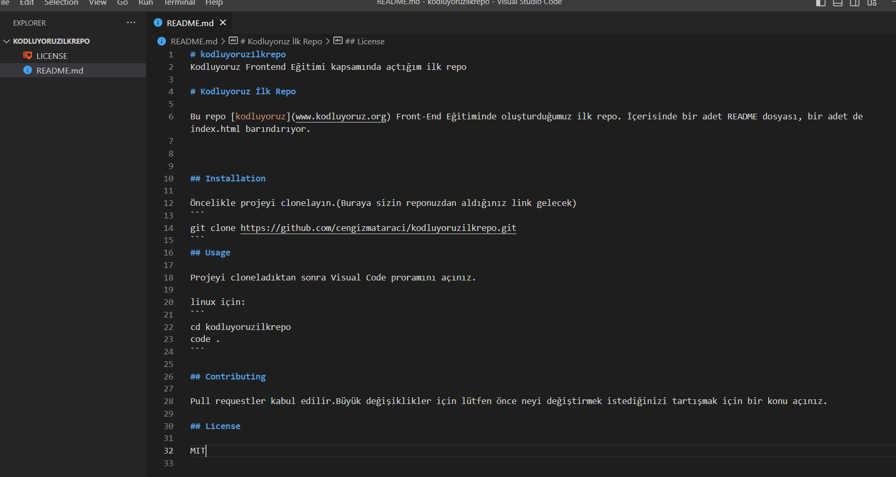

# kodluyoruzilkrepo
Kodluyoruz Frontend Eğitimi kapsamında açtığım ilk repo

# Kodluyoruz İlk Repo

Bu repo [kodluyoruz](www.kodluyoruz.org) Front-End Eğitiminde oluşturduğumuz ilk repo. İçerisinde bir adet README dosyası, bir adet de index.html barındırıyor.



## Installation

Öncelikle projeyi clonelayın.(Buraya sizin reponuzdan aldığınız link gelecek)
```
git clone https://github.com/cengizmataraci/kodluyoruzilkrepo.git
```
## Usage 

Projeyi cloneladıktan sonra Visual Code proramını açınız.

linux için;
```
cd kodluyoruzilkrepo
code .
```

## Contributing

Pull requestler kabul edilir.Büyük değişiklikler için lütfen önce neyi değiştirmek istediğinizi tartışmak için bir konu açınız.

## License

MIT


[proje-görüntüsü.png]: proje-görüntüsü.png